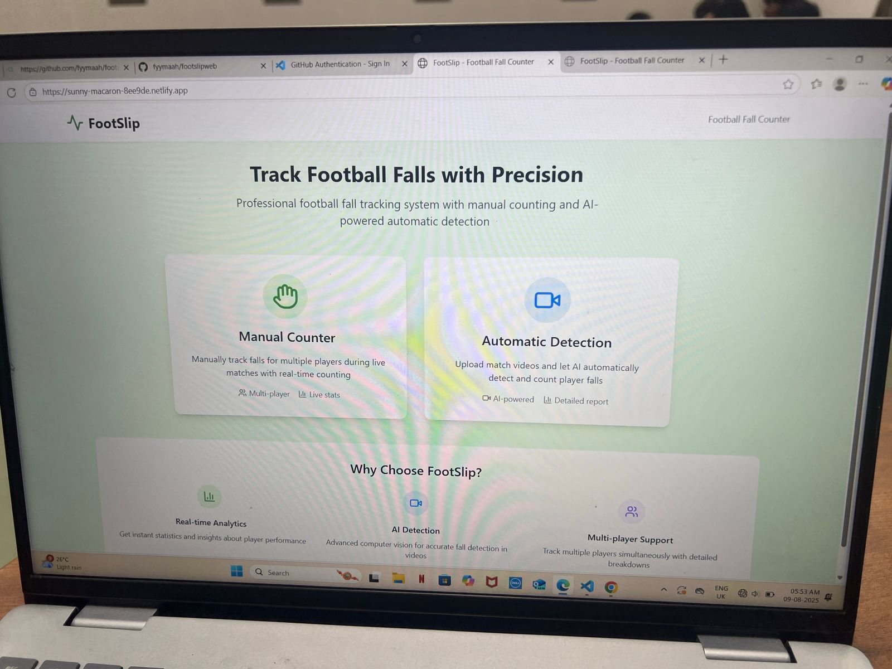
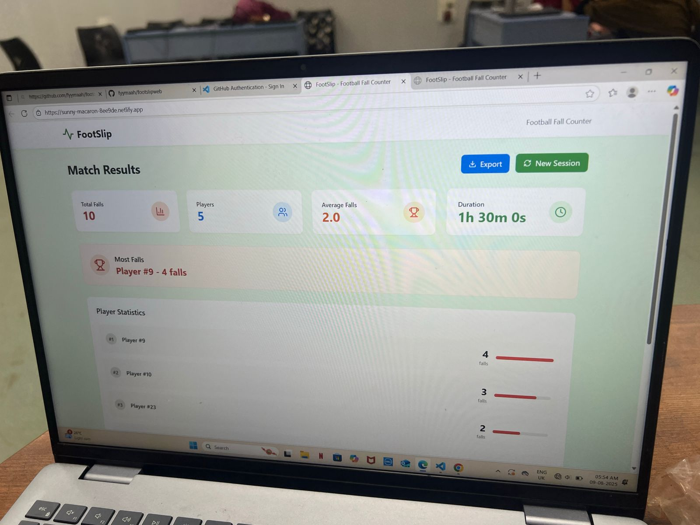

# [footslip] 🎯

## Basic Details
### Team Name: [Techcrews]

### Team Members
- Team Lead: [Fathimath faheema] - [Lbs college of engineering kasaragod]
- Member 2: [Mariyamath fahida] - [Lbs College of engineering kasaragod]

### Project Description
[website which counts the number of falls of a player in a football match]

### The Problem (that doesn't exist)
[How many times a football player falls]

### The Solution (that nobody asked for)
[video of football match can be uploaded and it will automatically counts the nhmber of falls.It also have the option to count manually for a live match.]

## Technical Details
### Technologies/Components Used
For Software:
- [CSS, javascript,html]
- [Bolt]
- [github]
- 

### Project Documentation
For Software:

# Screenshots (Add at least 3)

*Add caption explaining what this shows*

[picture of website](IMG-20250809-WA0004.jpg)
*Add caption explaining what this shows*

*Add caption explaining what this shows*

# Diagrams

*Add caption explaining your workflow*

For Hardware:

# Schema)tic & Circuit

*Add caption explaining connections*

*Add caption explaining the schematic*

# Build Photos

*List out all components shown*

*Explain the build steps*

*Explain the final build*

### Project Demo
# Video
[project demo video](VID-20250809-WA0010.mp4)
*Explain what the video demonstrates*

# Additional Demos
[Add any extra demo materials/links]

## Team Contributions
- [Name 1]: [Specific contributions]
- [Name 2]: [Specific contributions]
- [Name 3]: [Specific contributions]

---
Made with ❤️ at TinkerHub Useless Projects 

